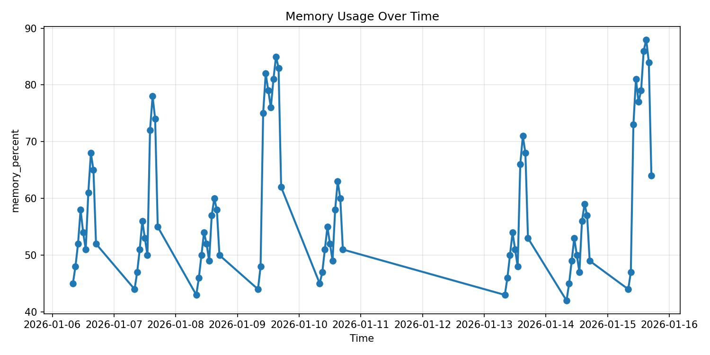

# Module 01: Build AI Agents with Azure Foundry Portal and VS Code

## Objective
Architected and deployed an IT Support AI Agent using the Azure AI Foundry. The agent was configured with dual-tooling capabilities: Retrieval-Augmented Generation (RAG) for querying organizational IT policies, and a Python-based Code Interpreter sandbox for analyzing system performance metrics. Programmatic interaction was handled via the Azure AI Projects SDK in Python.

## Key Skills Demonstrated
* **Azure AI Foundry:** Project provisioning, agent configuration, and model deployment.
* **Agentic Tooling:** Implementing and balancing multiple tools (File Search for semantic retrieval, Code Interpreter for data processing).
* **Python SDK Integration:** Building a local client application to interface with the cloud-hosted agent.
* **Prompt Engineering:** Directing agent tool-selection behavior for specific data analysis tasks.

## Technical Challenge & Resolution
**Challenge:** Initially, the agent failed to analyze the `system_performance.csv` data, attempting to use the File Search semantic index rather than the Code Interpreter sandbox.
**Resolution:** Applied explicit prompt engineering (e.g., *"Analyze the system performance data in the code interpreter tool..."*) to force the agent to bypass semantic search, spin up the Python sandbox, and successfully execute `pandas` and `scikit-learn` scripts to extract data correlations.

## Evidence of Work
*The agent successfully answered RAG-based policy questions and performed complex data analysis, identifying a 0.98 Pearson correlation between CPU and Memory usage during high-load periods.*

### Generated Visualizations

*(Note: Ensure your image path matches where you saved the file)*

### Example Terminal Execution
```text
You:  Find any correlation between high CPU usage and memory usage in the performance data

[Agent is thinking...]

Agent: Yes — there’s a strong positive correlation between CPU usage and memory usage in the performance data.

Key findings:
- Overall Pearson correlation: 0.97
- Correlation during high-CPU periods only (>80% CPU): 0.98
- Average memory usage when CPU was above 80%: 78.5%
```
